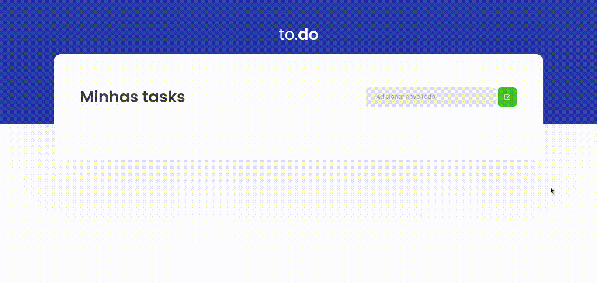

	
	
  
  
  <a href="https://github.com/caiofuccio">
	  
	<a/>

 

<h1  align="center">
  
</h1>

<h4 align="center">
    ✅ to.do | Lista de Tarefas ✅
     
</h4>

 <a href="#💻-sobre">Sobre</a> •
 <a href="#⚙️-funcionalidades">Funcionalidades</a> •
 <a href="#🖼️-layout">Layout</a> • 
 <a href="#🧰-como-executar">Como executar</a> • 
 <a href="#🚀-tecnologias">Tecnologias</a> • 
 <a href="#👨‍💻-autor">Autor</a>

 

## 💻 Sobre
O to.do é uma lista de tarefas simples, para que você possa organizar seus afazeres e consiga monitorar quais tarefas já foram feitas e quais estão pendentes.

Esse projeto faz parte dos desafios da trilha ReactJS do bootcamp Ignite, promovido pela Rocketseat.

---

## ⚙️ Funcionalidades
- Você pode criar sua lista digitando as tarefas na barra superior e em seguida clicando no botão ✅.
- Você pode marcar suas tarefas como concluídas ou não clicando no botão 🔲 ou ☑️.
- Você pode excluir suas tarefas clicando no botão 🗑️.

---

## 🖼️ Layout

---

## 🧰 Como executar

    # Clone o repositório
    $ git clone git@github.com:caiofuccio/todo-list.git
	
	# Instale as dependências
	$ yarn
	
	# Execute a aplicação no modo de desenvolvimento
	$ yarn dev
	
	# A aplicação será aberta na porta:8080 - acesse https://localhost:8080

---

## 🚀 Tecnologias

	
	
	
	 
	
	
	 
	

---

## 👨‍💻 Autor

	
	 
	<strong>Caio Fuccio</strong>
	 
	 Front-End Developer | ReactJS
	 
	 
	
	

